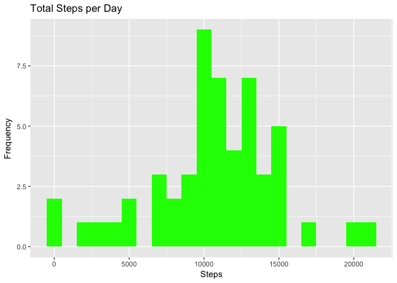
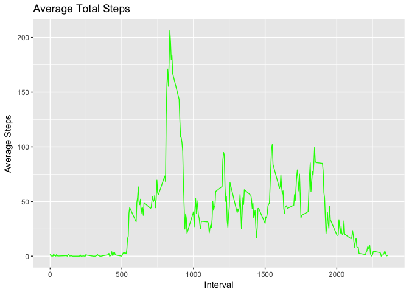
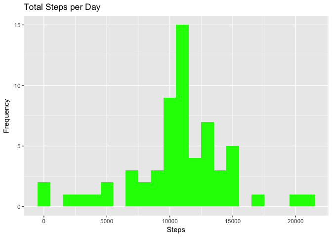

Loading and Preprocessing the Data
----------------------------------

    library(plyr)
    library(ggplot2)
    activity <- read.csv("activity.csv")
    activity$date <- as.Date(activity$date)

What is the mean total number of steps taken each day?
------------------------------------------------------

Make a histogram of the total number of steps each day.

    ## calculate daily steps
    day_act <- ddply(activity, .(date), summarize, total=sum(steps))

    g <- ggplot(day_act, aes(x=total))
    g <- g + geom_histogram(fill="green", binwidth=1000)
    g <- g + labs(title = "Total Steps per Day", x = "Steps", y = "Frequency")
    print(g)

    ## Warning: Removed 8 rows containing non-finite values (stat_bin).

### Mean of total number of steps taken each day

    mean(day_act$total, na.rm = TRUE)

    ## [1] 10766.19

### Median of total number of steps taken each day

    median(day_act$total, na.rm = TRUE)

    ## [1] 10765

What is the average daily activity pattern
------------------------------------------

### Make a time series plot (i.e. type = "l") of the 5-minute interval (x-axis) and the average number of steps taken, averaged across all days (y-axis)

    interval_act <- ddply(activity, .(interval), summarize, avgsteps=mean(steps, na.rm=TRUE))
    g <- ggplot(interval_act, aes(x=interval, y=avgsteps))
    g <- g + geom_line(color="green")
    g <- g + labs(title = "Average Total Steps", y = "Average Steps", x = "Interval")
    print(g)

### Which 5-minute interval, on average across all the days in the dataset, contains the maximum number of steps?

    interval_act[which.max(interval_act$avgsteps),]

    ##     interval avgsteps
    ## 104      835 206.1698

Imputing Missing Values
-----------------------

### Calculate and report the total number of missing values in the dataset

    nrow(activity[is.na(activity$steps),])

    ## [1] 2304

### Use the Mean for each interval to fill in the missing values in the dataset.

Create a new data set equal to the original data set but with the
missing data filled in.

    library(dplyr)

    ## Warning: package 'dplyr' was built under R version 3.4.1

    ## 
    ## Attaching package: 'dplyr'

    ## The following objects are masked from 'package:plyr':
    ## 
    ##     arrange, count, desc, failwith, id, mutate, rename, summarise,
    ##     summarize

    ## The following objects are masked from 'package:stats':
    ## 
    ##     filter, lag

    ## The following objects are masked from 'package:base':
    ## 
    ##     intersect, setdiff, setequal, union

    fullact <- activity
    fullact <- fullact %>% group_by(interval) %>% mutate(avgsteps = mean(steps, na.rm=TRUE))
    fullact[is.na(fullact$steps),]$steps <- fullact[is.na(fullact$steps),]$avgsteps
    head(fullact)

    ## # A tibble: 6 x 4
    ## # Groups:   interval [6]
    ##       steps       date interval  avgsteps
    ##       <dbl>     <date>    <int>     <dbl>
    ## 1 1.7169811 2012-10-01        0 1.7169811
    ## 2 0.3396226 2012-10-01        5 0.3396226
    ## 3 0.1320755 2012-10-01       10 0.1320755
    ## 4 0.1509434 2012-10-01       15 0.1509434
    ## 5 0.0754717 2012-10-01       20 0.0754717
    ## 6 2.0943396 2012-10-01       25 2.0943396

Make a new histogram of total steps taken each day.
---------------------------------------------------

    nday_act <- ddply(fullact, .(date), summarize, total=sum(steps))

    g <- ggplot(nday_act, aes(x=total))
    g <- g + geom_histogram(fill="green", binwidth=1000)
    g <- g + labs(title = "Total Steps per Day", x = "Steps", y = "Frequency")
    print(g)

### Mean of total number of steps taken each day

    mean(nday_act$total)

    ## [1] 10766.19

### Median of total number of steps taken each day

    median(nday_act$total)

    ## [1] 10766.19

Are there differences in activity patterns between weekdays and weekends?
-------------------------------------------------------------------------

Create a new factor variable in the dataset with two levels – “weekday”
and “weekend” indicating whether a given date is a weekday or weekend
day.

    fullact <- fullact %>% mutate(dayofweek = weekdays(date))

    fullact[fullact$dayofweek=="Saturday",]$dayofweek <- "weekend"
    fullact[fullact$dayofweek=="Sunday",]$dayofweek <- "weekend"
    fullact[fullact$dayofweek!="weekend",]$dayofweek <- "weekday"

    head(fullact)

    ## # A tibble: 6 x 5
    ## # Groups:   interval [6]
    ##       steps       date interval  avgsteps dayofweek
    ##       <dbl>     <date>    <int>     <dbl>     <chr>
    ## 1 1.7169811 2012-10-01        0 1.7169811   weekday
    ## 2 0.3396226 2012-10-01        5 0.3396226   weekday
    ## 3 0.1320755 2012-10-01       10 0.1320755   weekday
    ## 4 0.1509434 2012-10-01       15 0.1509434   weekday
    ## 5 0.0754717 2012-10-01       20 0.0754717   weekday
    ## 6 2.0943396 2012-10-01       25 2.0943396   weekday

### Make a panel plot containing a time series plot (i.e. 𝚝𝚢𝚙𝚎 = "𝚕") of the 5-minute interval (x-axis) and the average number of steps taken, averaged across all weekdays or weekends (y-axis).

See the README file in the GitHub repository to see an example of what
this plot should look like using simulated data.

    g <- ggplot(fullact, aes(x=interval, y=avgsteps))
    g <- g + geom_line(color="green")
    g <- g + labs(title = "Average Total Steps", y = "Average Steps", x = "Interval")
    g <- g + facet_wrap(~dayofweek, nrow=2, ncol=1)
    print(g)

